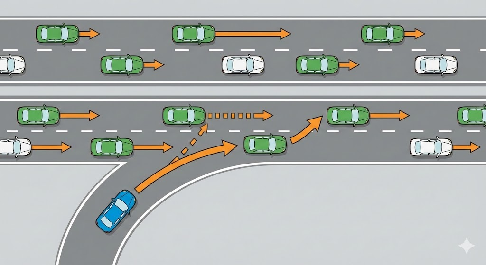

# Motorway Rules

---

## Who can use the motorway

Motorways must **not** be used by pedestrians, cyclists, motorcycles under **50 cc**, horse riders, certain slow-moving vehicles, or powered wheelchairs and mobility scooters.

Provisional licence holders may only drive on the motorway if accompanied by a **DVSA Approved Driving Instructor** in a dual-control car displaying L plates (D plates in Wales).

---

## Joining the motorway

Use the **slip road** to build up speed and match the flow of traffic in the left-hand lane. Give way to vehicles already on the motorway – do not force your way in. Try to avoid stopping at the end of the slip road.

After joining, **stay in the left-hand lane** until you're used to the higher speeds before considering overtaking.

---

## Lane discipline

Always use the **left-hand lane** unless overtaking. The right-hand lane is for overtaking only – it is not the "fast lane." After passing slower vehicles, move back to the left when it's safe.

You may only overtake on the left when traffic is moving in **queues** and the queue on your right is slower than yours.

Vehicles **towing a trailer** must not use the right-hand lane on a motorway with three or more lanes, unless directed (e.g. at lane closures). They are also limited to **60 mph**.

---

## Speed limit

The national speed limit on motorways for cars and motorcycles is **70 mph**, unless signs indicate otherwise. Temporary speed limits at **roadworks** are compulsory – not advisory. Cameras are often used to enforce them.

---

## Reflective studs

Different coloured studs help you identify your position at night or in poor visibility:

- **Red** – left-hand edge (between carriageway and hard shoulder)
- **White** – between lanes
- **Amber** – right-hand edge (next to the central reservation)
- **Green** – at slip-road entrances and exits
- **Bright green/yellow** – at roadworks and contraflow systems

> If red studs are on your left and white on your right, you are in the **left-hand lane**.

---

## Countdown markers

**Countdown markers** (three bars, two bars, one bar) are positioned **90 metres (100 yards)** apart, starting 270 metres from the slip road. Move into the **left-hand lane** well before you reach them.

---

## Leaving the motorway

Get into the left-hand lane **in good time**. You'll see the first direction sign one mile from the exit and another at the half-mile point. Do not cut across lanes at the last moment.

If you **miss your exit**, carry on to the next one. It is illegal to reverse, stop or turn around on a motorway.

After leaving, check your **speedometer** – you may be going faster than you realise.

---

## Stopping on the motorway

You must not stop on the motorway except:

- In an **emergency** or breakdown (use the hard shoulder if available)
- When signalled to stop by **traffic signals**, a police officer or traffic officer
- In a **traffic queue**

Never stop on the hard shoulder to rest, use your phone, check a map or have a picnic. If tired, leave at the next exit or stop at a **service area**.

---

## Breakdowns

If you break down on the **hard shoulder**:

- Pull as far left as possible
- Leave by the **nearside (left) door** – keep away from the carriageway
- Walk to an **emergency roadside telephone** (follow arrows on marker posts at 100-metre intervals)
- **Face oncoming traffic** when using the phone, to see approaching hazards
- Wait **well away from the carriageway** for help to arrive
- Do not attempt repairs yourself

If using a mobile phone, find the number on the nearest **marker post** so the operator knows your exact location.

To rejoin after repair, build up speed on the **hard shoulder** and filter into a safe gap. Do not force your way in.

---

## Smart motorways

On a smart motorway, the hard shoulder may be used as a **running lane** when signs above show a speed limit. A **red cross** above a lane means it is **closed** – move out of it immediately.

If you break down and **cannot reach the hard shoulder**, switch on your **hazard warning lights**. Leave the vehicle only when you can safely get clear of the carriageway.

**Emergency areas** (marked with blue signs and an orange SOS phone symbol) are provided for breakdowns and emergencies on smart motorways.

---

## Hazard warning lights

Use your hazard lights briefly on a motorway to warn traffic behind when you have to **slow down or stop suddenly** due to a hazard ahead. If the car in front shows hazard lights, expect **queuing or stopped traffic**.

---

## Contraflow systems

In a contraflow, expect **lower speed limits**, narrower lanes and no permanent barrier between you and oncoming traffic. Keep a safe distance from the vehicle ahead and do not switch lanes.

---

## Before a long journey

Check your vehicle before a motorway journey: **fuel, oil, water and tyres**. Continuous high speeds increase the risk of breakdown. Plan **rest stops** in advance.
