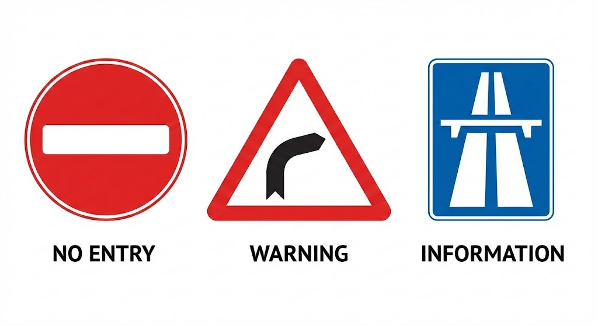
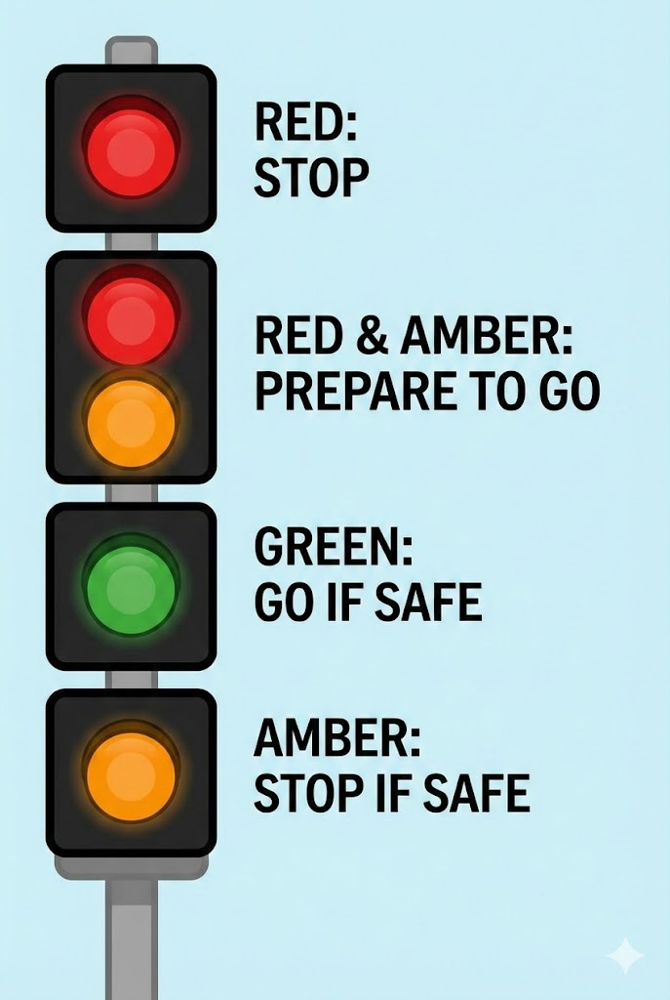

# Road and Traffic Signs

---

## Sign shapes and types

There are three main types of road sign:

- **Circular** signs give **orders** (red border = prohibition, blue = mandatory instruction)
- **Triangular** signs give **warnings** about hazards ahead
- **Rectangular** signs give **information** or directions

The **stop sign** is the only octagonal sign – so it can be recognised even when covered by snow. Brown signs indicate **tourist directions**.

---

## Prohibitory signs (red circle)

Red circle signs tell you what you **must not** do. Common examples:

- **No entry** – a white bar on a red circle
- **No motor vehicles** – often found in pedestrianised shopping areas
- **No overtaking** – two cars side by side in a red circle
- **No stopping (clearway)** – a red cross on a blue background
- **No right turn / No left turn**

A white circular sign with a **black diagonal stripe** means the **national speed limit** applies.

---

## Mandatory signs (blue circle)

Blue circular signs tell you what you **must** do: turn left ahead, keep left, minimum speed, or follow a one-way system. A blue circle with a **30** inside means a **minimum speed limit** of 30 mph. A red slash through it marks the **end of the minimum speed**.

---

## Warning signs (triangle)

Triangular warning signs alert you to hazards, including:

- **T-junction**, crossroads, roundabout, double bend
- **Steep hill** (uphill or downhill) – read the gradient from left to right
- **Side winds** – shown by a windsock icon
- **Risk of ice**, road humps, level crossing, trams crossing
- **Cycle route ahead** – watch for cyclists rejoining the road
- **Pedestrians in the road** – leave plenty of room
- **Hump bridge** – slow down; your view ahead is restricted

A general **"Danger ahead"** triangle with an exclamation mark may be accompanied by a plate describing the hazard.

---

## Speed limit signs

A red circle with a number gives a **compulsory maximum speed limit**. Temporary limits at roadworks must be obeyed – they are **not advisory**.

The end of a motorway restriction is shown by the same sign **without flashing lights**. Where a **20 mph zone** ends, you'll see a sign showing the zone has finished and the 30 mph limit begins.

---

## Road markings

A **broken white centre line** marks the centre of the road. When the lines become **longer than the gaps**, it is a **hazard warning line** – do not cross unless you can see the road is clearly ahead.

**Double white lines**: if the line nearest you is solid, do not cross it except to pass a stationary vehicle, a cyclist, a horse, or a road maintenance vehicle travelling at 10 mph or less, or to enter a side road.

**Hatched markings** separate traffic flowing in opposite directions. If bordered by a **solid white line**, do not enter except in an emergency.

**White zigzag lines** near pedestrian crossings mean **no parking** at any time. White triangles painted on the surface indicate **road humps**.

---

## Traffic lights

The sequence is: **red → red and amber → green → amber → red**.

- **Red** (including red and amber) = stop behind the stop line
- **Green** = go, if your exit is clear
- **Amber alone** = stop, unless you've already crossed the line or stopping would cause a collision

At some junctions, **filter arrows** allow specific lanes to proceed. If traffic lights are **out of order**, treat the junction as an unmarked crossroads – proceed with great care.

---

## Signals and the horn

Flash your headlights **only** to warn others of your presence – never to signal them to proceed. The horn must not be used between **11:30 pm and 7:00 am** in a built-up area, or when stationary, unless there is danger.

**Hazard warning lights** may be used while driving on a motorway or dual carriageway to warn traffic behind of a hazard or sudden slowdown ahead.

Always **cancel your indicators** after turning – leaving them on can mislead others and cause a collision.

---

## Motorway signs and studs

**Countdown markers** (three, two, one bar) are spaced 90 metres apart before each exit. A number on a motorway sign (e.g. **25**) indicates the **junction number**.

A **red cross** above a lane means **do not use that lane**. An arrow pointing downward to the left means **change to the lane on your left**.

---

## Police signals

If a police car flashes its headlights and the officer points to the left, **pull up on the left** and switch off your engine. You must obey signals from police officers, traffic wardens and school crossing patrols.

---

## Diversion routes

When a diversion is in place, follow a symbol on yellow signs – a black **triangle, square, circle or diamond** will guide you along the route.
