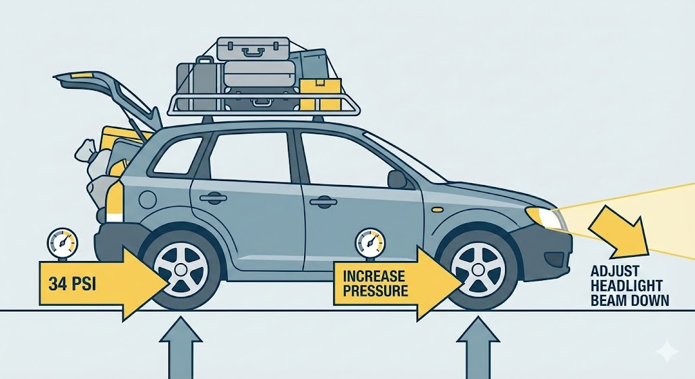
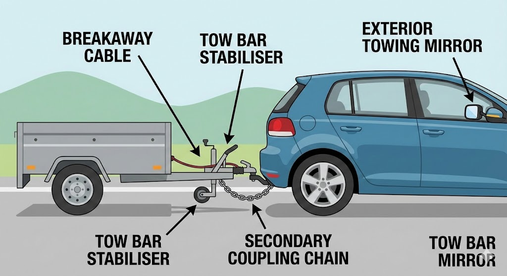

# Vehicle Loading

---

## Effects of loading

Any load affects your vehicle's handling – the heavier the load, the worse the effect. A heavy load on a **roof rack** raises the centre of gravity and **reduces stability**, especially on bends and corners.

The **driver** is always responsible for making sure a vehicle is not overloaded.

---

## Roof racks

Loads on a roof rack must be **securely fastened** with suitable restraints. A specially designed roof box is the safest option – it keeps luggage dry and reduces wind resistance.

Remove the roof rack when not in use to reduce **fuel consumption**.

---

## Tyre pressures

When carrying a heavy load, **increase** your tyre pressures above the normal value. Check the vehicle handbook for guidance. You may also need to adjust your **headlights** to compensate for the vehicle sitting lower at the rear.

---

## Towing a trailer

When towing, you must not exceed **60 mph** on motorways and dual carriageways. On a three-lane motorway, you must not use the **right-hand lane** unless directed (e.g. at roadworks).

If your trailer starts to swing from side to side (**snaking**), ease off the accelerator gently. Do not brake harshly or steer sharply.

A **stabiliser** fitted to the tow bar helps with handling in side winds and buffeting from large vehicles, but it does not overcome instability from incorrect loading.

---

## Trailer safety equipment

A **breakaway cable** must be fitted to the trailer braking system. If the trailer detaches, it activates the trailer brakes before snapping free.

When hitching an **unbraked trailer**, fit a **secondary coupling device** such as a safety chain. Before every journey, check that all trailer **lights and tyres** are in working order. The minimum tread depth is **1.6 mm**.

If a trailer is **wider than your car**, you must fit **exterior towing mirrors**.

---

## Maximum authorised mass (MAM)

The **MAM** is the maximum combined weight of the trailer and its load, as stamped on the chassis plate. Do not exceed it.

If you've just passed your driving test, you may tow a trailer with a MAM of up to **3,500 kg** without an extra test. For heavier trailers, you'll need a **CE or DE** category test.

---

## Noseweight

The tow hitch must exert an appropriate **downward force** (noseweight) on the tow ball. Check the maximum permitted noseweight in your **vehicle handbook**. Distribute weight evenly, with heavy items over the axle(s).

---

## Passengers in a towed caravan

Passengers must **never** ride in a caravan that is being towed. Moving passengers make the caravan unstable and could cause loss of control.

---

## Child restraints

Children under **3 years old** must use a suitable **child seat**. All restraints must be appropriate for the child's size and weight, and fitted according to the manufacturer's instructions.

It is your responsibility as the driver to ensure all children are properly secured.

---

## Before towing for the first time

Take **professional training** before towing a trailer for the first time. You need to understand hitching, checking for defects, reversing and dealing with problems on the road.

