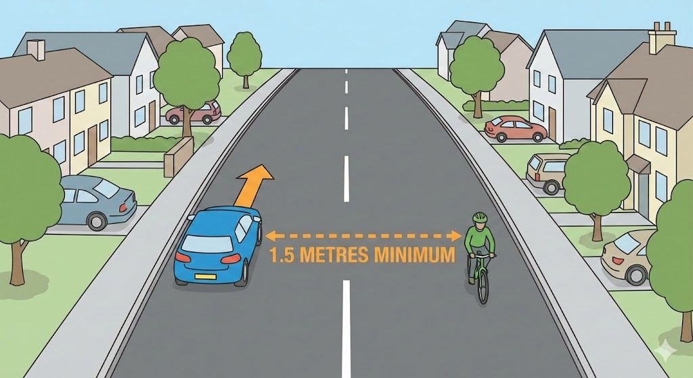

# Vulnerable Road Users

---

## Pedestrians

When turning left into a side road, **give way** to pedestrians who have already started crossing. Do not rush them with your horn, lights or engine.

On **country roads** without a pavement, pedestrians are advised to walk on the right – facing oncoming traffic. Expect to find them on **your side** of the road.

If a ball bounces out from between parked cars, **slow down and be prepared to stop** – a child may follow it.

---

## Older and disabled people

Be patient with older pedestrians – they may take longer to cross and could **misjudge your speed**. They may also be hard of hearing.

At a **pelican crossing**, if a disabled person is crossing slowly when the light turns green, **wait** for them to finish. A person carrying a white stick with a **red band** is both deaf and blind – your horn will not help.

At a **zebra crossing**, be prepared to stop for anyone waiting, including people in **wheelchairs**. Never wave them across.

---

## Children and schools

Yellow **zigzag lines** outside a school mean you must **not wait or park** there. Parking blocks the view and endangers children.

**Flashing amber lights** under a school warning sign mean slow down and be ready to stop. A **school crossing patrol** will display a stop sign – you must obey it.

Look out for **school buses** – they may stop at places other than normal bus stops.

---

## Cyclists

Give cyclists **as much room as a car** when overtaking. They may need to swerve around potholes, drain covers or be blown by side wind.

At **junctions**, cyclists are harder to see – they can be hidden behind parked cars. Cyclists approaching a roundabout in the left lane may actually be turning **any direction** – give them plenty of room.

Before changing lanes in slow traffic, check for **motorcyclists and cyclists filtering** through gaps.

---

## Motorcyclists

Motorcyclists use **dipped headlights** in daylight and wear **bright clothing** to be more visible. Despite this, they are among the most **vulnerable** road users.

Before turning right, always check your **right mirror and blind spot** – a motorcyclist may be overtaking on your right.

When a motorcyclist glances over their **right shoulder**, they are likely about to change direction. Anticipate their next move.

If a slow-moving motorcyclist is ahead and you're unsure of their intentions, **stay behind** – they may be looking for a turning.

---

## Horse riders

When overtaking horses, drive **slowly** and leave **plenty of room**. Horses are easily frightened by sudden or loud noises – do not rev your engine or sound your horn.

At a **roundabout**, horse riders often stay on the outside even when turning right. Allow them space to cross lanes.

---

## Large vehicles

Stay **well back** when following a lorry – it blocks your forward view and the driver may not see you in their mirrors. Large vehicles need extra room to turn and may take an unusual course at junctions and roundabouts.

---

## Learner drivers

Be **patient and calm** around learners. They may react more slowly to traffic situations. Do not follow too closely or show impatience.

---

## Young and new motorcyclists

Young riders are more often involved in incidents due to **inexperience and overconfidence**. It takes time to develop judgement and riding skill.

---

## Crossings summary

| Crossing | Key feature |
|---|---|
| **Zebra** | Black-and-white stripes, Belisha beacons – slow and prepare to stop |
| **Pelican** | Flashing amber = give way to pedestrians still crossing |
| **Puffin** | Sensors detect pedestrians – no flashing amber phase |
| **Toucan** | Shared by pedestrians and **cyclists** – no flashing amber |

---

## Reversing safely

Before reversing, **get out and check** if you're unsure the area is clear – a small child may be hidden behind the vehicle. If a pedestrian is waiting to cross behind you, **give way** to them.

When reversing into a side road, the front of your vehicle swings out – watch for passing traffic. Never reverse from a side road into a **main road**.
